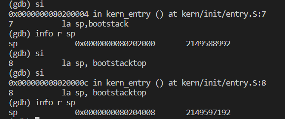
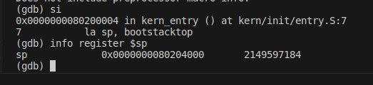
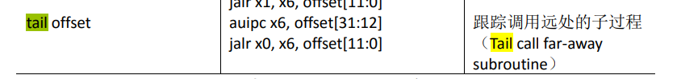
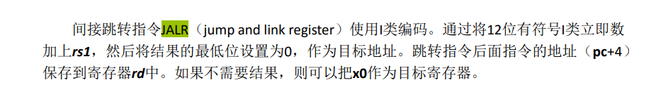
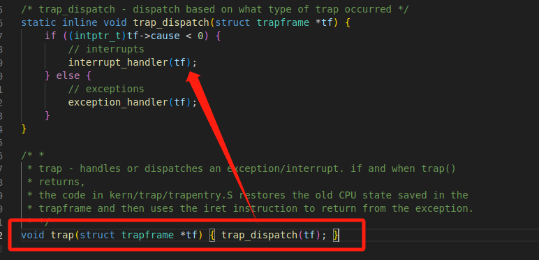
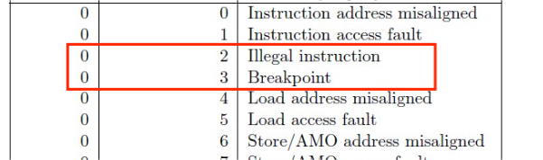
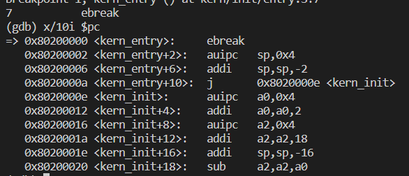
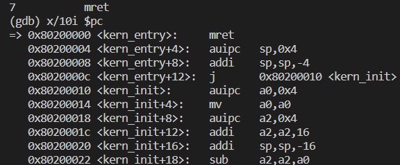
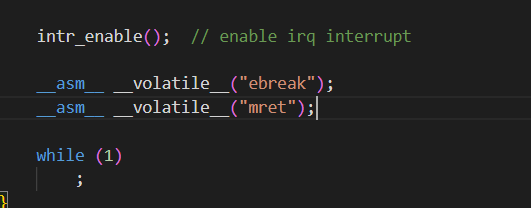
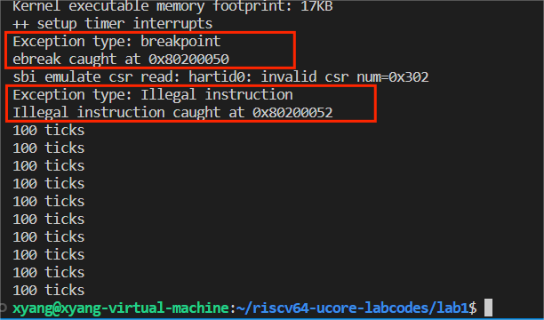

## 练习一：内核启动中的程序入口操作
### **la sp,bootstacktop**

RISC-V中的la伪指令是 Load Address 的缩写，它用于将某个标签（通常是一个全局变量或标签）的地址加载到寄存器中。la指令并不加载标签所指向的数据，而只是加载标签的地址。

RISC-V架构中的sp寄存器是栈指针寄存器，用于跟踪栈的顶部位置,由此可知la sp, bootstacktop的作用是将bootstacktop标记的地址加载到sp寄存器中。

在entry.S的代码的.data段中,有如下的代码：
```armasm
 .align PGSHIFT     #;内存页一页有4096 bytes，因此要进行2的12次方的对齐
    .global bootstack
bootstack:
    .space KSTACKSIZE  #;留出两页，8KB大小的空间
    .global bootstacktop
bootstacktop:
```
由于.data段会从低地址往高地址分配数据空间，因此会导致最终bootstacktop标记的地址，比bootstack高出KSTACKSIZE个字节。这样分配的目的是，当操作系统开始运行需要将数据压入栈时，会调用sp指针，栈抬高，sp指针会减小，而由于bootstacktop比bootstack高出KSTACKSIZE个字节，这就意味着操作系统有了一个8KB的栈空间。而la sp,bootstacktop这句指令的作用便显而易见，便是初始化好一个8KB的栈空间。


<!-- 为了进行验证测试，我们在la sp,bootstacktop前加入了一条la sp,bootstack:

```armasm
kern_entry:
    la sp,bootstack
    la sp, bootstacktop
```

调试的结果如下：



可以计算，
```
栈空间 = (0x80204008-0x8020000c) - (0x80202000-0x80200004) = 0x2000 = KSTACKSIZE
``` -->
<!-- 

在调试程序时，执行完 entry.s中的la sp, bootstacktop后我们通过获取寄存器信息发现sp中存储的是0x0000000080204000

 -->

<!-- 所以可以得知kern_entry这一段代码在加载内核时帮住os初始化了栈结构，并在把控制权转给操作系统之后将栈结构也交给了操作系统。 -->

### **tail kern_init**

通过查阅risc v指令集，我们发现tail伪指令可以拆分为两个操作


其中第一个操作是将offset的前20位拓展到32位并加载到寄存器x6中


第二操作将将目标地址设为忽略了最低位的offset


tail 指令是一种特殊的跳转指令，通常用于无条件地跳转到指定的目标地址，并且不会保存返回地址。这意味着在执行 tail 指令后，不会返回到跳转前的指令，而是直接开始执行目标地址处的指令，因此此处的tail kern_init意味着跳转到内核的真正“入口点” kern_init处，并且开始执行，执行完毕也不会返回entry.S中该处，这代表着内核正式开始接管并进行操作。


# kern_init的探究
更进一步，观察init.c的代码。
```c
    int kern_init(void) {
        extern char edata[], end[];
        memset(edata, 0, end - edata);

        cons_init();  // init the console

        const char *message = "(THU.CST) os is loading ...\n";
        cprintf("%s\n\n", message);

        print_kerninfo();

        // grade_backtrace();

        idt_init();  // init interrupt descriptor table

        // rdtime in mbare mode crashes
        clock_init();  // init clock interrupt

        intr_enable();  // enable irq interrupt
        
        while (1)
            ;
    }
```

在kern_init中，首先调用了<mark> idt_init </mark>  函数：
```c
    void idt_init(void) {
        extern void __alltraps(void);
        /* Set sscratch register to 0, indicating to exception vector that we are
        * presently executing in the kernel */
        write_csr(sscratch, 0);
        /* Set the exception vector address */
        write_csr(stvec, &__alltraps);
    }
```
对该函数的解释分析如下：

1. `extern void __alltraps(void);`：声明了一个名为 `__alltraps` 的外部函数。这个函数是一个中断和异常处理的入口点，它包含了处理各种中断和异常的代码，详细作用和流程会在下文探讨；

2. `write_csr(sscratch, 0);`：将 Supervisor 虚拟寄存器 `sscratch` 的值设置为 0。这个寄存器用于保存异常处理过程中的临时状态，将其设置为 0 可以表示当前运行在内核态（Supervisor Mode）。

3. `write_csr(stvec, &__alltraps);`：将 Supervisor 虚拟寄存器 `stvec` 的值设置为 `&__alltraps`。`stvec`通常用于保存“中断向量表基址”，即中断和异常的处理入口点，由于lab1中只有一个`__alltraps`处理函数，因此将 `__alltraps` 的地址保存到`stvec`即可；

调用完毕idt_init函数后，中断描述表被初始化，异常处理的入口地址被设置，同时当前执行环境被标记为内核模式，以便正确处理异常和中断。这是操作系统内核初始化过程中的一部分，用于确保系统在开始运行时具备正确的异常处理能力。

调用完<mark> idt_init </mark>后，我们又调用了 <mark> clock_init</mark>函数：
```c
    void clock_init(void) {
        // enable timer interrupt in sie
        set_csr(sie, MIP_STIP);
        // divided by 500 when using Spike(2MHz)
        // divided by 100 when using QEMU(10MHz)
        // timebase = sbi_timebase() / 500;
        clock_set_next_event();

        // initialize time counter 'ticks' to zero
        ticks = 0;

        cprintf("++ setup timer interrupts\n");
    }

```

sie寄存器是RISC-V体系结构中的一个特权寄存器，它用于控制和管理中断相关的使能和状态。sie寄存器的全称是"Supervisor Interrupt-Enable Register"，它在特权级别为超级用户（Supervisor）时起作用。sie寄存器通常包含多个中断相关的位字段，其中包括各种类型的中断，如软件中断、定时器中断、外部中断等。这些位字段用于启用或禁用相应类型的中断。当某个位字段被设置为1时，表示允许相应类型的中断触发，而设置为0则表示禁用。不同的RISC-V实现和架构可以定义不同的sie寄存器位字段。

sie寄存器中有MIP_STIP位（Machine Timer Interrupt Pending），它用于表示机器模式（Machine Mode）下的计时器中断是否待处理。具体来说，当MIP_STIP位被置位（设置为1）时，表示存在一个计时器中断等待被处理。在RISC-V处理器中，计时器中断通常是通过定时器硬件产生的中断，用于实现定时操作或者周期性的中断。当计时器中断触发时，它会设置MIP_STIP位，通知处理器有一个计时器中断需要被处理。操作系统或者监管程序可以通过检查MIP_STIP位来确定是否有定时器中断待处理，如果MIP_STIP被置位，处理程序可以相应地执行中断处理例程，完成相应的操作，例如更新系统时间或执行周期性任务。


不难从源码中结合查阅的资料与注释信息看出它的功能是实现了允许时间中断。并设置下一个时间片。这个函数中还有记录中断次数以及输出提供信息功能。


## <span id="jump">定时器中断中断处理流程</span>

当定时器中断触发，会由scause寄存器保存中断原因，并跳转到`stvec`寄存器所保存的函数地址，在此前的探究中，已经得知`stvec`保存了`__all_traps`的地址，因此会跳转到此处进行中断的处理：
```armasm
__alltraps:
    SAVE_ALL

    move  a0, sp
    jal trap
    # sp should be the same as before "jal trap"

    .globl __trapret
__trapret:
    RESTORE_ALL
    # return from supervisor call
    sret
```
`SAVE_ALL`是一个宏指令，用于将32个通用寄存器和4个特殊寄存器按照一定顺序保存到栈中，即用于保存当前进程的上下文。此后`move a0,sp`将栈指针（此时指向在栈中保存的上下文的地址）存于a0中，作为下一步trap的参数进行传参，方便进一步处理中断，并用jal指令跳转到trap函数，处理完毕再进行上下文的恢复；

可以得知，`trap`实际上封装了
 <mark>void trap(struct trapframe *tf) { trap_dispatch(tf); }</mark>来实现异常处理：

 

其中trap需要的参数`trapframe *tf`由寄存器a0中保存的上下文的地址提供，trap可以根据此地址访问保存在栈中的上下文的各个寄存器；而在`trap_dispatch`中，会先根据`scause`寄存器的最高位是0还是1（如果是1，那么有符号的int会小于0）判断是中断(interrupt)还是异常(exception)，接着再跳转到相应的函数中进行处理。

由于时钟中断是属于中断(interrupt)类型的异常，因此会跳转到`interrupt_handler(tf)`中进行进一步的处理，这也是练习二需要完善的部分。

## 练习二：完善中断处理
由于定时器中断属于Supervisor timer interrupt类型的中断，我们需要在`case IRQ_S_TIMER`下完善中断处理代码（`IRQ_S_TIMER`是宏定义的5）

```c
case IRQ_S_TIMER:
            // "All bits besides SSIP and USIP in the sip register are
            // read-only." -- privileged spec1.9.1, 4.1.4, p59
            // In fact, Call sbi_set_timer will clear STIP, or you can clear it
            // directly.
            // cprintf("Supervisor timer interrupt\n");
             /* LAB1 EXERCISE2   YOUR CODE :  */
             clock_set_next_event(); //设置下一处的时钟中断
             ticks++;                //ticks在clock.h中声明为外部变量，可以直接调用
             if(ticks == TICK_NUM){  //达到100ticks
                print_ticks();       //进行输出
                num++;               //打印次数增加1
                ticks = 0;           //重新设置ticks为0
             }
             if(num == 10){         //若打印了10此，则关机
                sbi_shutdown();
             }

            /*(1)设置下次时钟中断- clock_set_next_event()
             *(2)计数器（ticks）加一
             *(3)当计数器加到100的时候，我们会输出一个`100ticks`表示我们触发了100次时钟中断，同时打印次数（num）加一
            * (4)判断打印次数，当打印次数为10时，调用<sbi.h>中的关机函数关机
            */
            break;
```


## Challenge1:描述与理解中断流程

### **ucore中处理中断异常的流程**
<!-- **中断产生的硬件支持**：sstatus寄存器中有二进制位SIE，数值为0的时候，如果当程序在S态运行，将禁用全部中断。在clock_init函数中通过置位得到了硬件的支持。OpenSBI提供的sbi_set_timer()接口，可以传入一个时刻，让它在那个时刻触发一次时钟中断。rdtime伪指令，读取一个叫做time的CSR的数值，表示CPU启动之后经过的真实时间。在不同硬件平台，时钟频率可能不同。在QEMU上，这个时钟的频率是10MHz, 每过1s, rdtime返回的结果增大10000000 -->

**中断的产生**：在`kern_init`中，我们一开始只设置一个时钟中断，而由于我们在练习二中完善的代码，每当一次时钟中断触发，中断处理程序会调用`clock_set_next_event()`来设置下一次的中断，以此类推，前一次的中断会设置好下一次的中断。在clock_set_next_event()中，会调用`sbi_set_timer()`设置时钟中断，timer的数值变为当前时间 + timebase：
```c
void clock_set_next_event(void) { sbi_set_timer(get_cycles() + timebase); }
```
**中断处理部分**： RISCV有大量控制状态寄存器，用于处理中断异常；scause寄存器会保存触发中断的原因，sepc寄存器会保存触发中断异常的指令的地址，stval会保存一些辅助信息，而stvec会保存”中断向量表基址”，由于lab1中只有一个`__alltraps`处理入口，因此在此前我们事先将`__alltraps`地址保存到了stvec中,详细的中断处理流程可见[上文](#jump)


### **mov a0，sp的目的**
在`__alltraps`中，会调用`SAVE_ALL`宏指令，将32个通用和4个CSR寄存器按照一定顺序保存到栈中，在该指令执行后，sp栈指针会指向这个上下文结构体在栈中的地址，而恰好下一步trap处理函数会用到该上下文的地址作为参数，因此需要将sp指向的上下文地址赋予a0（a0寄存器常用作参数寄存器），以便trap函数进一步处理中断。


### **SAVE_ALL中寄存器保存在栈中的顺序**
trap的参数是一个trapframe类型的指针，trapframe是一个结构体类型，里面依次排列通用寄存器x0到x31,然后依次排列4个和中断相关的CSR寄存器sstatus，sepc，sbadvaddr，以及scause。

在遇到中断时，`__alltraps`会调用`SAVE_ALL`将这总共36个寄存器保存到栈中，而保存的顺序也要和trapframe中寄存器排列的顺序相同，先将sp抬高36个寄存器的空间，然后从栈顶sp的开始依次保存x0到x31，再保存sstatus，sepc，sbadvaddr，scause。这是因为在trap中，会通过保存在栈中的上下文的地址为基址（此时是x0保存在栈中的地址），按照trapframe中寄存器的排列顺序为偏移量来访问各个寄存器的值，因此需要保证，`SAVE_ALL`保存寄存器的顺序（从低地址到高地址）和trapframe中寄存器排列顺序相同。

### **是否总是需要保存所有寄存器的值**

对于任何中断，总是需要保存所有寄存器，这与刚刚提到的SAVE_ALL中保存寄存器在栈中的顺序有关，因为需要保证栈中的寄存器的结构和顺序与trapframe结构体一致，否则通过tf指针访问各个寄存器时会出现错误；

## Challenge2：理解上下文切换机制

### csrw sscratch, sp；csrrw s0, sscratch, x0的作用和目的
`csrw sscratch, sp`指令的作用是保存原先的栈顶指针到sscratch，因为下一条` addi sp, sp, -36`会改变sp的位置，考虑到之后需要恢复栈帧，因此要保存sp的原先值到sscratch中。由于sscratch寄存器在处理用户态程序的中断时才起作用，目前用处不大，因此可以用来保存sp的值。

而csrrw s0, sscratch, x0则是因为RISCV不能直接将CSR写到内存, 需要csrrw指令把CSR读取到通用寄存器s0，再将通用寄存器s0保存到内存,并利用zero寄存器x0将sscratch寄存器置0（恢复）。

### SAVE_ALL里面保存了stval scause这些csr，而在restore all里面却不还原它们？那这样store的意义何在呢？

首先，没有恢复的寄存器是sepc、scause、stval，它们的作用如下：

sepc会记录触发中断的指令的地址；scause会记录中断发生的原因，还会记录该中断是不是一个外部中断；stval会记录一些中断处理所需要的辅助信息，比如指令获取、访存、缺页异常，会把发生问题的目标地址或者出错的指令记录下来。

我们将这些寄存器储存下来是为了保证栈中寄存器的排列顺序能构成一个trapframe结构体，从而可以传递参数给trap函数。而在恢复的时，中断处理程序已经基于这几个csr寄存器完成了处理，因此此时没有必要去恢复csr寄存器的值。


## Challenge3：完善异常中断
Challenge3要求完善触发`Illegal Instruction` 和 `breakpoint`类型的异常时的处理代码，要求输出错误类型和错误代码的地址，并更新epc寄存器的值，方便此后恢复执行时pc指向正确的被执行代码。

在理清了异常触发的流程后，思路变得十分清晰，


如图，`Illegal Instruction` 和 `breakpoint`类型的异常分别对应2和3的Exception Code，在lab1的trap.c的exception handler处理函数中，2和3分别对应宏定义变量`CAUSE_ILLEGAL_INSTRUCTION`和`CAUSE_BREAKPOINT`，因此补全代码为：

```c
case CAUSE_ILLEGAL_INSTRUCTION:
           cprintf("Exception type: Illegal instruction\n");
           cprintf("Illegal instruction caught at 0x%08x\n",tf->epc);
           tf->epc +=4 ; //如mret，触发illegal instruction的指令长度通常为4
           
            break;
        case CAUSE_BREAKPOINT:
           
           cprintf("Exception type: breakpoint\n");
           cprintf("ebreak caught at 0x%08x\n",tf->epc);
            tf->epc += 2; //触发breakpoint异常的指令 ebreak的长度为2
            break;
```

对于ebreak和mret的指令的长度则是我们反复调试的结果



为了测验Challenge3的效果，我们在init.c中嵌入了asm汇编代码：


此后在编译运行lab1时，可以看到两种异常对应的输出，并且程序可以正常的继续运行，说明epc更新正确：


## 操作系统特权层级总结

从以上的实验流程中，我们可以看出，要想更好的理解本lab中中断和异常的处理，需要比较熟悉x86和Risc-V的特权层级等知识点。由于我们是把ucore移植到Risc-V上，因此在这一点上会出现一些区别，但这并不十分体现在lab1的代码中：

1. **x86**
   - x86 架构上，有四个主要的特权级别，分别是Ring 0 ~ Ring 3，其中Ring 0是内核模式，Ring 3是用户模式。而 ucore 的 x86 版本实现了 Ring 0 和 Ring 3 。

2. **RiscV**
   - M-mode (机器模式，缩写为 M 模式) 是 RISC-V 中硬件线程可以执行的最高权限模式，类似于x86架构中的 Ring 0，在 M 模式下运行的 hart 对内存,I/O 和一些对于启动和配置系统来说必要的底层功能有着完全的使用权。发生**所有异常**(不论在什么权限模式下)的时候,控制权都会被移交到 M 模式的异常处理程序
   - 另外的一种与 M 模式十分接近的 S 模式（Supervisor Mode）的特权级别，通常用于支持操作系统内核的运行和管理。M 模式的异常处理程序可以将异常重新导向 S 模式，也支持通过中断委托选择性地将中断和同步异常直接交给 S 模式处理, 而完全绕过 M 模式。比较特别的一点是`SIE == 0`时，如果当程序在S态运行，将禁用全部中断
   - 用户程序运行在 U 模式（User Mode），U 模式是较低的特权级别，类似于x86的 Ring 3

## 中断与异常

在本次实验中，我们完善了时钟中断，并在 challenge 中通过内联汇编完善了触发`Illegal Instruction` 和 `breakpoint`类型的异常时的处理代码。

中断（Interrupt）和异常（Exception）都是 OS 中用于处理异步事件的机制，但触发原因和处理方式上有一些重要区别：

1. **触发原因**：
   
      - **中断**：中断是外部设备或其他硬件组件发出的信号，通常用于引发与系统交互相关的事件，例如这里的时钟中断。中断是由硬件发起的，与当前正在执行的程序无关，因此是异步事件。

      - **异常**：异常通常是由正在执行的程序中的错误、非法操作或特殊情况引发的事件，例如这里的非法指令和断点异常等。异常是由当前执行的程序引发的，因此是同步事件。

2. **处理方式**：

      - **中断**：中断会导致处理器暂停当前正在执行的指令流，然后转而执行一个中断处理程序（Interrupt Service Routine，ISR）。一旦中断处理程序完成，处理器会返回到原来的指令流。中断允许系统在不中断当前任务的情况下响应外部事件。

      - **异常**：异常会导致处理器立即暂停当前的指令流，并跳转到异常处理程序。异常处理程序通常用于处理程序错误或非法操作，可能会终止当前的进程或线程。异常会中断当前任务的正常执行流程。

3. **优先级和处理**：

      - **中断**：中断通常具有不同的优先级，系统可以配置中断控制器以确定哪个中断应该首先处理。多个中断可以并发触发和处理。

      - **异常**：异常通常按照固定的异常处理流程进行处理，通常没有优先级，处理程序是确定的，且异常是按顺序处理的。

## lab1中部分重要文件的源码含义

1. sbi.c
   - 该文件中，有一个较为重要的函数是sbi_call()，它是一个使用内联汇编实现的函数，用于调用 SBI的指定功能。它接受的四个参数中，`sbi_type` 表示要调用的 SBI 功能，`arg0`、`arg1` 和 `arg2` 是 SBI 调用的参数。函数首先将参数加载到适当的寄存器中，然后使用 `ecall` 指令触发 SBI 调用，最后将返回值从寄存器中读取并返回给调用方。
   - 借用该函数，实现了`sbi_console_getchar` 从控制台获取字符、`sbi_console_putchar` 将字符打印到控制台。`sbi_set_timer` 函数用于设置计时器的值。 `sbi_shutdown` 函数用于关闭系统。
   - 后两者在我们的练习中都提到了，`sbi_set_timer` 设置时钟中断，而`sbi_shutdown` 在 100ticks 触发10次时调用。
2. clock.c
   - `get_cycles` 的目的是获取当前的 CPU 周期数（cycles）。逻辑上根据 RISC-V 架构的位数来选择不同的实现方式。
    - 如果 RISC-V 架构的位数是 64 位（`__riscv_xlen == 64`），那么它使用 `rdtime` 指令来获取当前的计时周期数。这个值以 64 位无符号整数的形式返回。
    - 如果 RISC-V 架构的位数为 32 位，那么分别读取存储时间的两个32位寄存器来获取时间戳，（高32位和低32位）。具体地，它使用 `rdtimeh` 和 `rdtime` 指令，还需要确保高位没有不变才能保证获取的时间戳有效。最终合并为一个 64 位的时间戳返回。


## 本次实验的知识点：
- 中断产生的具体过程
- 中断处理的整个过程
- 中断前后如何进行上下文环境的保存与恢复
- 时钟中断
- 中断处理函数的使用
	
其中，中断产生的具体过程、中断处理的整个过程、断前后如何进行上下文环境的保存与恢复对应于os中的进程切换过程。时钟中断对应于时间片轮转调度。而中断处理函数的使用类似对应于switchto操作（实现进程切换中的现场保存于跳转）


## 实验没有涉及到的知识点：

- 如何知道一个程序要触发“慢操作”？
- 如何实现计算资源的共享共用？
- PCB表的具体应用形式？