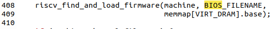
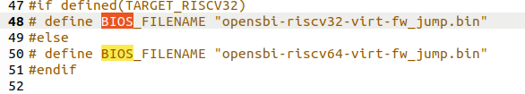

#  操作系统lab0 & lab0.5实验报告

**李远宇 2110498                   朱霞洋 2113301           李秉睿 2113087** 


本次实验中，小组成员研究探讨了启动Qemu，并结合GDB进行远程调试的过程，并通过GDB的单步调试、查看寄存器状态和riscv-5汇编代码的方法，对于Qemu的启动和bootloader以及内核镜像的加载过程有了大致了解。我们将Qemu模拟的virt machine启动的流程分为三个阶段：
1. virt machine加电开机时将计算机系统处理器、内存等初始化，并加载启动启动Bootloader；
2. Bootloader开始工作，将操作系统镜像os.bin从物理硬盘加载到内存中；
3. 控制权交给操作系统，计算机开始工作
接下来将进一步探讨各阶段，并探究Qemu加电时的几条指令的位置和功能，并回答RISC-V硬件加电后的几条指令在哪里，和其完成了什么功能两个问题。

## 第一阶段：Qemu加电开机，加载启动Bootloader
在电脑开机运行之前，需要Bootloader程序将操作系统加载到内存中。在QEMU模拟的riscv计算机里，其自带的bootloader: OpenSBI固件会被加载到内存地址 0x80000000 开头的区域上，然后将操作系统镜像 os.bin 加载到内存地址 0x80200000 开头的区域上。然而本次实验发现，Qemu加电开机时的前几条指令并不位于0x80000000，而是位于0x1000的复位地址上，说明前几条指令并不是Bootloader，而是一段初始化代码，会将t0寄存器初始化为0x80000000，然后在0x1010处的


指令会跳转到t0指向的地址，运行Bootloader


在查阅资料后，我们得知了这段代码的作用：
```armasm
auipc t0, 0x0 ;这是一条"Add Upper Immediate to PC" (AUIPC) 指令。它将立即数（这里是0x0）扩展并加到当前指令地址的高 20 位上，并将结果存储在寄存器 t0 中。
addi a1, t0, 32 ;这是一条"Add Immediate" (ADDI) 指令。它将寄存器 t0 中的值与立即数 32 相加，并将结果存储在寄存器 a1 中。这个指令用于将值 32 加到 t0 寄存器中的值。
csrr a0, mhartid ;这是一条"Control and Status Register Read" (CSRR) 指令。它用于读取控制和状态寄存器（CSR）中的 mhartid 寄存器的值，并将结果存储在寄存器 a0 中。mhartid 寄存器通常包含处理器的硬件线程 ID。
ld t0, 24(t0) ;这是一条"Load Doubleword" (LD) 指令。它用于从内存地址 t0 + 24 读取一个双字（64位）的数据，并将数据加载到寄存器 t0 中。
jr t0 ;这是一条"Jump Register" (JR) 指令。它将寄存器 t0 中的值解释为跳转目标地址，并跳转到该地址。这里 t0 寄存器中的值是 ld 指令加载的内存地址，因此程序将跳转到那个地址。
```
为了更好地理解Qemu加电启动的流程，以及搞清楚为什么会从0x1000开始运行指令，我们找到了Qemu启动时重置cpu的源码，源码定义了重置cpu的函数，有以下这段代码：
```c
// in /target/riscv/cpu.c
static void riscv_cpu_reset(CPUState *cs)
{
    RISCVCPU *cpu = RISCV_CPU(cs);
    RISCVCPUClass *mcc = RISCV_CPU_GET_CLASS(cpu);
    CPURISCVState *env = &cpu->env;

    mcc->parent_reset(cs);
#ifndef CONFIG_USER_ONLY
    env->priv = PRV_M;
    env->mstatus &= ~(MSTATUS_MIE | MSTATUS_MPRV);
    env->mcause = 0;
    env->pc = env->resetvec;
#endif
    cs->exception_index = EXCP_NONE;
    env->load_res = -1;
    set_default_nan_mode(1, &env->fp_status);
}
```
这段代码首先从传递给函数的 CPUState 结构指针中得到RISC-V CPU的状态和配置。然后调用 mcc->parent_reset(cs)，其中parent_reset 调用了RISC-V CPU的父类（通用CPU类）的 reset 函数，执行通用的重置操作。
接下来，如果没有定义 CONFIG_USER_ONLY，执行以下操作：
  - 设置机器模式。
  - 禁用中断和重定位权限模式。
  - 表示清除异常原因。
  - 将CPU的程序计数器（PC）设置为复位向量地址env->resetvec。
于是推测env->resetvec的值为0x1000。

执果索因，我们最终在cpu.c引入的头文件中，找到了resetvec设置的线索：

在初始化的阶段中，Qemu内部会执行一个set_resetvec函数，将env->resetvec重置为DEFAULT_RSTVEC，而这个DEFAULT_RSTVEC又在头文件的宏定义中，设置为了固定值0x1000，因此可知，这个复位地址是由Qemu内部决定的，是运行bootloader之前的先导过程，用于初始化电脑的cpu和内存等。


## 第二阶段：Bootloader将内核镜像os.bin加载至内存
上面提到，在单步调试时，Qemu加电启动到0x1010时，会跳转到Bootloader的内存起始地址开始执行代码：

接下来计算机运行的汇编指令较为冗长复杂，期间涉及多次跳转，因此，我们阅读了在qemu模拟 Risc-V的C的源代码中，其中写出了操作系统初始化模拟RiscV环境主板的流程。
```c
// in /target/riscv/virt.c
static void riscv_virt_board_init(MachineState *machine)
{
    const struct MemmapEntry *memmap = virt_memmap;

    RISCVVirtState *s = g_new0(RISCVVirtState, 1);
    MemoryRegion *system_memory = get_system_memory();
    MemoryRegion *main_mem = g_new(MemoryRegion, 1);
    MemoryRegion *mask_rom = g_new(MemoryRegion, 1);
    char *plic_hart_config;
    size_t plic_hart_config_len;
    int i;
    unsigned int smp_cpus = machine->smp.cpus;
    void *fdt;
    
    /*...*/
    
    /* boot rom */
    memory_region_init_rom(mask_rom, NULL, "riscv_virt_board.mrom",
                           memmap[VIRT_MROM].size, &error_fatal);
    memory_region_add_subregion(system_memory, memmap[VIRT_MROM].base,
                                mask_rom);

    /* 
    load kernel os.bin
    */
    riscv_find_and_load_firmware(machine, BIOS_FILENAME,
                                 memmap[VIRT_DRAM].base);

    if (machine->kernel_filename) {
        uint64_t kernel_entry = riscv_load_kernel(machine->kernel_filename);

        if (machine->initrd_filename) {
            hwaddr start;
            hwaddr end = riscv_load_initrd(machine->initrd_filename,
                                           machine->ram_size, kernel_entry,
                                           &start);
            qemu_fdt_setprop_cell(fdt, "/chosen",
                                  "linux,initrd-start", start);
            qemu_fdt_setprop_cell(fdt, "/chosen", "linux,initrd-end",
                                  end);
        }
    }

    /* reset vector */
    uint32_t reset_vec[8] = {
        0x00000297,                  /* 1:  auipc  t0, %pcrel_hi(dtb) */
        0x02028593,                  /*     addi   a1, t0, %pcrel_lo(1b) */
        0xf1402573,                  /*     csrr   a0, mhartid  */
#if defined(TARGET_RISCV32)
        0x0182a283,                  /*     lw     t0, 24(t0) */
#elif defined(TARGET_RISCV64)
        0x0182b283,                  /*     ld     t0, 24(t0) */
#endif
        0x00028067,                  /*     jr     t0 */
        0x00000000,
        memmap[VIRT_DRAM].base,      /* start: .dword memmap[VIRT_DRAM].base */
        0x00000000,
                                     /* dtb: */
    };

    /* copy in the reset vector in little_endian byte order */
    for (i = 0; i < sizeof(reset_vec) >> 2; i++) {
        reset_vec[i] = cpu_to_le32(reset_vec[i]);
    }
    rom_add_blob_fixed_as("mrom.reset", reset_vec, sizeof(reset_vec),
                          memmap[VIRT_MROM].base, &address_space_memory);

    /* copy in the device tree */
    if (fdt_pack(s->fdt) || fdt_totalsize(s->fdt) >
            memmap[VIRT_MROM].size - sizeof(reset_vec)) {
        error_report("not enough space to store device-tree");
        exit(1);
    }
    qemu_fdt_dumpdtb(s->fdt, fdt_totalsize(s->fdt));
    rom_add_blob_fixed_as("mrom.fdt", s->fdt, fdt_totalsize(s->fdt),
                          memmap[VIRT_MROM].base + sizeof(reset_vec),
                          &address_space_memory);
    
    /*...*/
    
    g_free(plic_hart_config);
}
```
这段代码是 QEMU 中 RISC-V 架构的 virt 机型的初始化代码，它的作用是初始化虚拟机的内存布局和其他必要的配置，特别是针对 RISC-V 的 Virt 机型。

1. const struct MemmapEntry *memmap = virt_memmap;：这行代码定义了一个指向内存映射表的指针，该内存映射表描述了虚拟机的内存布局，包括 RAM、设备内存、固件等。

2. RISCVVirtState *s = g_new0(RISCVVirtState, 1);：这里创建了一个 RISC-V Virt 机型的状态结构体。这个结构体用于保存虚拟机的状态信息。

3. MemoryRegion *system_memory = get_system_memory();：获取系统内存的指针，系统内存是虚拟机中所有内存区域的容器。

4. MemoryRegion *main_mem = g_new(MemoryRegion, 1);：创建了一个新的内存区域用于表示主内存，但在这段代码中并没有被初始化。

5. MemoryRegion *mask_rom = g_new(MemoryRegion, 1);：创建了一个新的内存区域用于表示引导固件（boot ROM），并命名为 "riscv_virt_board.mrom"。

6. memory_region_init_rom(mask_rom, NULL, "riscv_virt_board.mrom", memmap[VIRT_MROM].size, &error_fatal);：初始化引导固件内存区域，该内存区域是只读的，用于存储虚拟机引导时执行的代码。

7. memory_region_add_subregion(system_memory, memmap[VIRT_MROM].base, mask_rom);：将引导固件内存区域添加到系统内存中，以便虚拟机可以访问并执行引导代码。

这段代码的核心功能是为 RISC-V Virt 机型初始化内存布局，其中包括主内存和引导固件，以便启动和运行虚拟机。它还涉及到一些其他配置和状态的初始化，以确保虚拟机的正确运行。
```c
    const struct MemmapEntry *memmap = virt_memmap;

    RISCVVirtState *s = g_new0(RISCVVirtState, 1);
    MemoryRegion *system_memory = get_system_memory();
    MemoryRegion *main_mem = g_new(MemoryRegion, 1);
    MemoryRegion *mask_rom = g_new(MemoryRegion, 1);
    char *plic_hart_config;
    size_t plic_hart_config_len;
    int i;
    unsigned int smp_cpus = machine->smp.cpus;
    void *fdt;
    
    /*...*/
    
    /* boot rom */
    memory_region_init_rom(mask_rom, NULL, "riscv_virt_board.mrom",
                           memmap[VIRT_MROM].size, &error_fatal);
    memory_region_add_subregion(system_memory, memmap[VIRT_MROM].base,
                                mask_rom);
```
加载内核时，我们发现了加载文件的路径,同时我们观察riscv_find_and_load_firmware函数的源码





```c
// in /target/riscv/virt.c

    /* 
    load kernel os.bin
    */
    
    riscv_find_and_load_firmware(machine, BIOS_FILENAME,
                                 memmap[VIRT_DRAM].base);
// in /target/riscv/boot.c
void riscv_find_and_load_firmware(MachineState *machine,
                                  const char *default_machine_firmware,
                                  hwaddr firmware_load_addr)
{
    char *firmware_filename;

    if (!machine->firmware) {
        /*
         * The user didn't specify -bios.
         * At the moment we default to loading nothing when this hapens.
         * In the future this defaul will change to loading the prebuilt
         * OpenSBI firmware. Let's warn the user and then continue.
        */
        if (!qtest_enabled()) {
            warn_report("No -bios option specified. Not loading a firmware.");
            warn_report("This default will change in a future QEMU release. " \
                        "Please use the -bios option to avoid breakages when "\
                        "this happens.");
            warn_report("See QEMU's deprecation documentation for details.");
        }
        return;
    }

    if (!strcmp(machine->firmware, "default")) {
        /*
         * The user has specified "-bios default". That means we are going to
         * load the OpenSBI binary included in the QEMU source.
         *
         * We can't load the binary by default as it will break existing users
         * as users are already loading their own firmware.
         *
         * Let's try to get everyone to specify the -bios option at all times,
         * so then in the future we can make "-bios default" the default option
         * if no -bios option is set without breaking anything.
         */
        firmware_filename = qemu_find_file(QEMU_FILE_TYPE_BIOS,
                                           default_machine_firmware);
        if (firmware_filename == NULL) {
            error_report("Unable to load the default RISC-V firmware \"%s\"",
                         default_machine_firmware);
            exit(1);
        }
    } else {
        firmware_filename = machine->firmware;
    }

    if (strcmp(firmware_filename, "none")) {
        /* If not "none" load the firmware */
        riscv_load_firmware(firmware_filename, firmware_load_addr);
    }

    if (!strcmp(machine->firmware, "default")) {
        g_free(firmware_filename);
    }
}
```
这段代码主要包括了以下操作：
1. 检查用户是否指定了 -bios 选项，如果没有，则打印警告信息，并提醒用户在未来的版本中需要指定 -bios 选项。
2. 如果用户指定了 -bios default，则尝试加载默认的 RISC-V 固件（OpenSBI 二进制文件）。如果找不到默认固件文件，则报错并退出。
3. 如果用户指定了自定义固件文件，则加载该自定义固件。
4. 如果用户指定了 -bios default，则释放默认固件的文件名内存。
总之，这段代码的目标是确保在启动 RISC-V 虚拟机时能够加载正确的固件或内核，或者提醒用户在未来的版本中指定 -bios 选项以保持一致性。
```c
    /* reset vector */
    uint32_t reset_vec[8] = {
        0x00000297,                  /* 1:  auipc  t0, %pcrel_hi(dtb) */
        0x02028593,                  /*     addi   a1, t0, %pcrel_lo(1b) */
        0xf1402573,                  /*     csrr   a0, mhartid  */
#if defined(TARGET_RISCV32)
        0x0182a283,                  /*     lw     t0, 24(t0) */
#elif defined(TARGET_RISCV64)
        0x0182b283,                  /*     ld     t0, 24(t0) */
#endif
        0x00028067,                  /*     jr     t0 */
        0x00000000,
        memmap[VIRT_DRAM].base,      /* start: .dword memmap[VIRT_DRAM].base */
        0x00000000,
                                     /* dtb: */
    };
```
这段代码构建了一个 RISC-V 平台的引导向量，它将系统引导到指定的内存地址，并初始化一些寄存器和 CSR 寄存器的值，以启动操作系统的引导过程。这段代码通常位于处理器的引导 ROM 中，并在硬件上电或重置时执行，从而启动操作系统的加载和执行过程。
1. **0x00000297:** 这是一个 RISC-V 汇编指令（机器指令），auipc 用于将程序计数器的高 20 位与一个偏移量相加，并将结果存储在目标寄存器（在这里是t0）。这里的 auipc t0, %pcrel_hi(dtb) 意味着将当前位置（1b 处）到数据表（DTB，Device Tree Blob）的高 20 位偏移量加载到t0 寄存器中。

2. **0x02028593:** 这是 addi 指令，将t0 寄存器中的值与 %pcrel_lo(1b) 中的低 12 位偏移量相加，结果存储在a1 寄存器中。这个操作用于计算相对于当前位置（1b 处）的低 12 位偏移量。

3. **0xf1402573:** 这是一个 csrr 指令，用于读取 CSR（Control and Status Register）寄存器的值。它读取mhartid 寄存器的值（机器模式下的硬件线程 ID），并将结果存储在a0 寄存器中。

4. **条件编译部分：**这部分代码根据目标 RISC-V 架构是 32 位还是 64 位来选择不同的指令。在 32 位情况下，它使用 lw 指令，而在 64 位情况下，它使用 ld 指令。这些指令都是从内存中加载数据到t0 寄存器中。

5. **0x00028067:** 这是 jr 指令，用于跳转到t0 寄存器中存储的地址，即启动引导过程。这是重要的引导指令。

6. **0x00000000:** 这是填充的空指令（NOP），用于保持指令地址对齐。

7. **memmap[VIRT_DRAM].base:** 这是一个注释，标志着引导向量的结束。
然后再接着对是否出现异常、加载操作结果、浮点数操作模式进行设置。
```c
    /* copy in the reset vector in little_endian byte order */
    for (i = 0; i < sizeof(reset_vec) >> 2; i++) {
        reset_vec[i] = cpu_to_le32(reset_vec[i]);
    }
    rom_add_blob_fixed_as("mrom.reset", reset_vec, sizeof(reset_vec),
                          memmap[VIRT_MROM].base, &address_space_memory);

    /* copy in the device tree */
    if (fdt_pack(s->fdt) || fdt_totalsize(s->fdt) >
            memmap[VIRT_MROM].size - sizeof(reset_vec)) {
        error_report("not enough space to store device-tree");
        exit(1);
    }
    qemu_fdt_dumpdtb(s->fdt, fdt_totalsize(s->fdt));
    rom_add_blob_fixed_as("mrom.fdt", s->fdt, fdt_totalsize(s->fdt),
                          memmap[VIRT_MROM].base + sizeof(reset_vec),
                          &address_space_memory);
    
    /*...*/
    
    g_free(plic_hart_config);
```
这段代码主要是将引导向量和设备树添加到系统的内存中。

1. for 循环将引导向量中的每个 32 位字从主机字节序（通常是大端字节序）转换为小端字节序。这是因为不同的 CPU 架构可能使用不同的字节序，而 RISC-V 通常使用小端字节序。cpu_to_le32 是一个函数，用于执行这个字节序转换。
2. rom_add_blob_fixed_as 函数将处理好的引导向量添加到内存中。它将引导向量的内容存储到名为 "mrom.reset" 的内存区域中，位置是 memmap[VIRT_MROM].base。这是引导 ROM 的一部分，用于启动系统。
3. 接下来，代码处理设备树（Device Tree）。它检查设备树是否已打包（packed）并检查设备树的总大小是否适合存储在引导 ROM 中。如果不适合，会输出错误消息并退出程序。
4. qemu_fdt_dumpdtb 函数将设备树的内容转储到 s->fdt 中，然后使用 rom_add_blob_fixed_as 函数将设备树添加到名为 "mrom.fdt" 的内存区域中。设备树通常用于描述硬件和系统配置信息，以便操作系统在引导时使用。
5. 最后，g_free 用于释放之前动态分配的 plic_hart_config 变量的内存，以便防止内存泄漏。

总之，这段代码负责初始化引导向量、设备树，并将它们存储在系统内存的适当位置，以便在启动过程中使用。这是启动和配置 RISC-V 虚拟机所必需的步骤之一。
之后，程序将依照判断优先级，加载操作系统固件、内核等，此时会返回KERNEL_BOOT_ADDRESS即宏定义的0x80200000，并最后跳转到该地址。
总结下来，bootloader在这个阶段将完成一些 CPU 的初始化工作，并且将操作系统镜像从硬盘加载到物理内存中，最后跳转到操作系统起始地址将控制权转移给操作系统。

## 第三阶段：操作系统接管计算机，计算机开始运行
在本次实验中，我们在操作系统起始位置0x80200000处打断点并运行到此处，可以发现此时计算机已经开始准备运行程序输出
```
(THU.CST) os is loading ...
```


