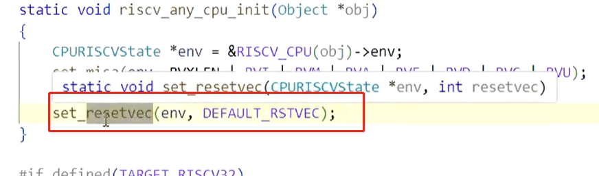
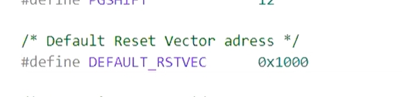
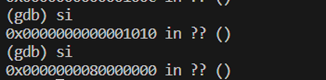
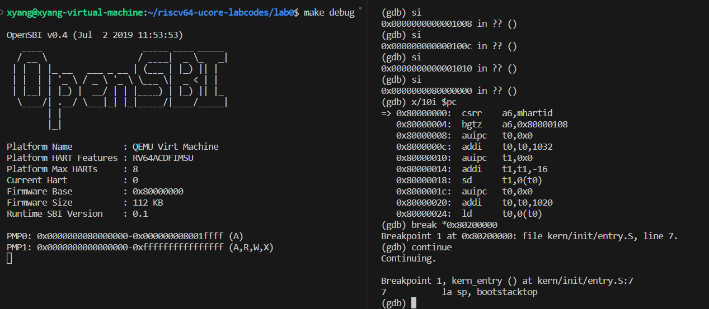

#  操作系统lab0 & lab0.5实验报告

**李远宇 2110498                   朱霞洋 2113301           李秉睿 2113087** 


本次实验中，小组成员研究探讨了启动Qemu，并结合GDB进行远程调试的过程，并通过GDB的单步调试、查看寄存器状态和riscv-5汇编代码的方法，对于Qemu的启动和bootloader以及内核镜像的加载过程有了大致了解。我们将Qemu模拟的virt machine启动的流程分为三个阶段：
1. virt machine加电开机时将计算机系统处理器、内存等初始化，并加载启动启动Bootloader；
2. Bootloader开始工作，将操作系统镜像os.bin从物理硬盘加载到内存中；
3. 控制权交给操作系统，计算机开始工作
接下来将进一步探讨各阶段，并探究Qemu加电时的几条指令的位置和功能，并回答RISC-V硬件加电后的几条指令在哪里，和其完成了什么功能两个问题。

## 第一阶段：Qemu加电开机，加载启动Bootloader
在电脑开机运行之前，需要Bootloader程序将操作系统加载到内存中。在QEMU模拟的riscv计算机里，其自带的bootloader: OpenSBI固件会被加载到内存地址 0x80000000 开头的区域上，然后将操作系统镜像加载到内存地址 0x80200000 开头的区域上。然而本次实验发现，Qemu加电开机时的前几条指令并不位于0x80000000，而是位于0x1000的复位地址上，说明前几条指令并不是Bootloader，而是一段初始化代码，会将t0寄存器初始化为0x80000000，然后在0x1010处的


指令会跳转到t0指向的地址，运行Bootloader


在查阅资料后，我们得知了这段代码的作用：
```armasm
auipc t0, 0x0 ;这是一条"Add Upper Immediate to PC" (AUIPC) 指令。它将立即数（这里是0x0）扩展并加到当前指令地址的高 20 位上，并将结果存储在寄存器 t0 中。
addi a1, t0, 32 ;这是一条"Add Immediate" (ADDI) 指令。它将寄存器 t0 中的值与立即数 32 相加，并将结果存储在寄存器 a1 中。这个指令用于将值 32 加到 t0 寄存器中的值。
csrr a0, mhartid ;这是一条"Control and Status Register Read" (CSRR) 指令。它用于读取控制和状态寄存器（CSR）中的 mhartid 寄存器的值，并将结果存储在寄存器 a0 中。mhartid 寄存器通常包含处理器的硬件线程 ID。
ld t0, 24(t0) ;这是一条"Load Doubleword" (LD) 指令。它用于从内存地址 t0 + 24 读取一个双字（64位）的数据，并将数据加载到寄存器 t0 中。
jr t0 ;这是一条"Jump Register" (JR) 指令。它将寄存器 t0 中的值解释为跳转目标地址，并跳转到该地址。这里 t0 寄存器中的值是 ld 指令加载的内存地址，因此程序将跳转到那个地址。
```
为了更好地理解Qemu加电启动的流程，以及搞清楚为什么会从0x1000开始运行指令，我们找到了Qemu启动时重置cpu的源码，源码定义了重置cpu的函数，有以下这段代码：
```c
// in /target/riscv/cpu.c
static void riscv_cpu_reset(CPUState *cs)
{
    RISCVCPU *cpu = RISCV_CPU(cs);
    RISCVCPUClass *mcc = RISCV_CPU_GET_CLASS(cpu);
    CPURISCVState *env = &cpu->env;

    mcc->parent_reset(cs);
#ifndef CONFIG_USER_ONLY
    env->priv = PRV_M;
    env->mstatus &= ~(MSTATUS_MIE | MSTATUS_MPRV);
    env->mcause = 0;
    env->pc = env->resetvec;
#endif
    cs->exception_index = EXCP_NONE;
    env->load_res = -1;
    set_default_nan_mode(1, &env->fp_status);
}
```
这段代码首先从传递给函数的 CPUState 结构指针中得到RISC-V CPU的状态和配置。然后调用 mcc->parent_reset(cs)，其中parent_reset 调用了RISC-V CPU的父类（通用CPU类）的 reset 函数，执行通用的重置操作。
接下来，如果没有定义 CONFIG_USER_ONLY，执行以下操作：
  - 设置机器模式。
  - 禁用中断和重定位权限模式。
  - 表示清除异常原因。
  - 将CPU的程序计数器（PC）设置为复位向量地址env->resetvec。
于是推测env->resetvec的值为0x1000。

执果索因，我们最终在cpu.c引入的头文件中，找到了resetvec设置的线索：

在初始化的阶段中，Qemu内部会执行一个set_resetvec函数，将env->resetvec重置为DEFAULT_RSTVEC，而这个DEFAULT_RSTVEC又在头文件的宏定义中，设置为了固定值0x1000，因此可知，这个复位地址是由Qemu内部决定的，是运行bootloader之前的先导过程，用于初始化电脑的cpu和内存等。


同时，我们在`/hw/riscv/virt.c`中找到了这一段复位初始化代码：
```c
    /* reset vector */
    uint32_t reset_vec[8] = {
        0x00000297,                  /* 1:  auipc  t0, %pcrel_hi(dtb) */
        0x02028593,                  /*     addi   a1, t0, %pcrel_lo(1b) */
        0xf1402573,                  /*     csrr   a0, mhartid  */
#if defined(TARGET_RISCV32)
        0x0182a283,                  /*     lw     t0, 24(t0) */
#elif defined(TARGET_RISCV64)
        0x0182b283,                  /*     ld     t0, 24(t0) */
#endif
        0x00028067,                  /*     jr     t0 */
        0x00000000,
        memmap[VIRT_DRAM].base,      /* start: .dword memmap[VIRT_DRAM].base */
        0x00000000,
                                     /* dtb: */
    };
```
`reset_vec`中每一个`uint32_t`变量都是一段riscv汇编代码的机器码，每次机器加电或复位时，都会运行此处设置好的代码。

## 第二阶段：Bootloader将内核镜像os.bin加载至内存
上面提到，在单步调试时，Qemu加电启动到0x1010时，会跳转到Bootloader的内存起始地址开始执行代码：



为了了解0x80000000到0x80200000之间bootloader所做的工作，我们找到了OpenSBI的源代码fw_base.S等，并对其进行了大致的了解。

在fw_base.S中，OpenSBI会进行底层初始化，包括：
- 检查mhartid的值
- 清除寄存器的值

- 清除bss段

- 设置栈指针（预留栈空间），读取设备树中的设备信息，设备树重定位，底层初始化结束等

- 设备初始化，启动处理器核心

    等工作。


总之，在0x80000000到0x80200000之间，bootloader会负责初始化引导向量、设备树，并将它们存储在系统内存的适当位置，以便在启动过程中使用。
之后，程序将依照判断优先级，加载操作系统固件、内核等，此时会返回KERNEL_BOOT_ADDRESS即宏定义的0x80200000，并最后跳转到该地址。


总结下来，在这个阶段将完成一些 CPU 的初始化工作，并且将操作系统镜像从硬盘加载到物理内存中，最后跳转到操作系统起始地址将控制权转移给操作系统。

## 第三阶段：操作系统接管计算机，计算机开始运行
在本次实验中，我们在操作系统起始位置0x80200000处打断点并运行到此处，可以发现此时计算机已经开始准备运行程序输出
```
(THU.CST) os is loading ...
```




## 知识点分析

### 重要知识点

下面列出一些本实验使用到的重要知识点：

1. 通过bootloader来加载操作系统：
    - bootloader的作用包括初始化硬件，加载操作系统等
    - bootloader的加载过程：
        - 加电后，硬件会从固定的地址开始执行指令
        - 该指令会将操作系统加载到内存中的固定位置
        - 该指令会跳转到操作系统的入口地址
2. gdb调试工具的使用
### 额外知识点
下面列出一些实验中没有但是关键的知识点：
 
1. 0x80000000 至 0x80200000 OpenSBI所做工作：
    包括fw_base.S进行底层初始化，包括重定位、清除寄存器的值、清除bss段、设置栈指针、读取设备树中的设备信息、设备树重定位

2. qemu的架构：

    - QEMU是一个开源的虚拟机和模拟器，它可以模拟多种硬件架构，包括x86、ARM、MIPS、PowerPC等等
    - QEMU的架构分为两层，上层是虚拟机管理器，下层是虚拟机执行器
    - 虚拟机管理器负责虚拟机的创建、启动、暂停、恢复、删除等操作，以及虚拟机的监控和管理
    - 虚拟机执行器负责虚拟机的运行，它模拟了虚拟机的硬件环境，包括CPU、内存、外设等